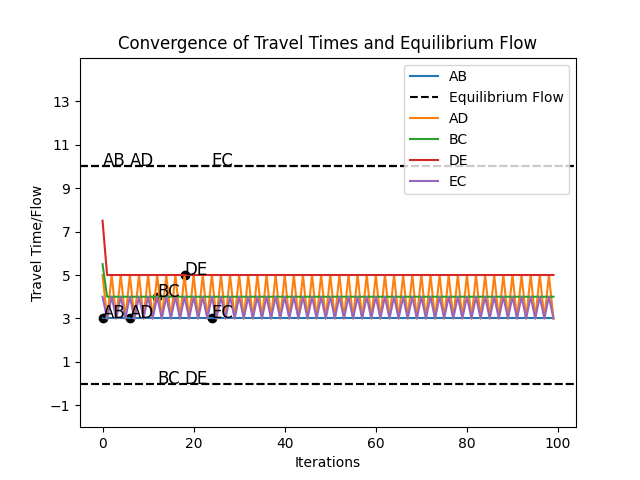

# Optimizing Transportation Networks: Achieving Equilibrium with Wardrop's Principle

In the realm of transportation engineering and urban planning, optimizing traffic flow in transportation networks is a critical endeavor. One fundamental principle guiding this optimization is Wardrop's Principle, which states that in an equilibrium state, the travel time experienced on all chosen routes by travelers is equal and minimum. In this blog post, we'll delve into how we can utilize Wardrop's Principle to achieve equilibrium in transportation networks, using Python as our tool of choice.

## Understanding Wardrop's Principle
Before delving into the technical details, let's first grasp the essence of Wardrop's Principle. Wardrop's principle, named after an English mathematician and transport analyst John Glen Wardrop, is a fundamental concept in transportation theory that provides insight into the behavior of travelers in a transportation network. It states that in a transportation network at equilibrium, the travel time experienced on all routes chosen by travelers is equal and minimum.

There are two key principles within Wardrop's principle:
1. **First Principle (Strong Equilibrium):** Under this principle, all routes chosen by travelers experience the same minimal travel time. In other words, no traveler can reduce their travel time by unilaterally changing their route. This is akin to the concept of User Equilibrium (UE), where travelers are selfishly optimizing their routes.
2. **Second Principle (Weak Equilibrium):** In this principle, all routes chosen by travelers experience travel times no less than the minimal travel time. While this allows for variation in travel times between routes, it ensures that no traveler can decrease their travel time by switching to a less congested route. This principle is similar to System Optimum (SO), where routes are assigned to minimize the total travel time for all travelers.
Wardrop's principle is crucial in transportation planning and engineering as it provides insights into route choice behavior and helps in the design and management of transportation networks. By understanding how travelers select routes to minimize their travel time, transportation planners can make informed decisions about infrastructure improvements, traffic management strategies, and policy interventions to optimize the performance of the transportation system.

In practice, Wardrop's principle guides the evaluation and optimization of transportation networks, ensuring that they operate efficiently and provide the best possible travel experience for users while minimizing congestion and travel delays.

Imagine a scenario where travelers in a transportation network aim to minimize their travel time. Wardrop's Principle dictates that once an equilibrium state is reached, no traveler can decrease their travel time by switching to a different route. Essentially, it ensures a fair and efficient allocation of traffic flow throughout the network.

## Problem Definition:
Given a transportation network represented by nodes and links, with each link having a corresponding travel time function, the objective is to find the equilibrium flow distribution on the network. The equilibrium flow distribution satisfies Wardrop's principle, where the travel time experienced on all chosen routes by travelers is equal and minimum.

## Modeling Travel Time Functions
To begin our journey towards equilibrium, we need to model the travel time functions for each link in the transportation network. These functions represent the relationship between traffic flow and travel time on a particular link. For simplicity, we'll define linear travel time functions, where travel time increases linearly with traffic flow.


### Formulation:
1. Transportation Network:
   - Nodes: A, B, C, D, E
   - Links: (A-B), (A-D), (B-C), (D-E), (E-C)

2. Travel Time Functions:
   - Link (A-B): T_AB(x_AB) = 2 + 0.1x_AB
   - Link (A-D): T_AD(x_AD) = 3 + 0.2x_AD
   - Link (B-C): T_BC(x_BC) = 4 + 0.15x_BC
   - Link (D-E): T_DE(x_DE) = 5 + 0.25x_DE
   - Link (E-C): T_EC(x_EC) = 3 + 0.1x_EC

   However, these functions can be customized to better represent real-world scenarios, incorporating factors such as congestion and road conditions.

3. Objective:
   Find the flow distribution (x_AB, x_AD, x_BC, x_DE, x_EC) on each link such that:
   - Wardrop's Principle: The travel time experienced on all chosen routes by travelers is equal and minimum.

4. Constraints:
   - Flow conservation at nodes: Total flow entering a node equals the total flow leaving the node.
   - Non-negativity constraint: Flow on each link cannot be negative.

5. Solution Approach:

**Iterative Algorithm for Equilibrium**
With our travel time functions in place, we can now implement an iterative algorithm to find the equilibrium flow distribution. Our algorithm iterates through each link in the network, adjusting the flow based on Wardrop's Principle until equilibrium is reached. At each iteration, we calculate the travel time for each route, identify the route with the minimum travel time, and allocate flow accordingly. This iterative process continues until the flow distribution converges to equilibrium or reaches a predefined maximum number of iterations.

   - Iteratively adjust flow on each link until equilibrium is reached.
   - Calculate travel time for each route based on current flow distribution.
   - Update flows based on Wardrop's principle: Flow is allocated to routes with minimum travel time.
   - Repeat until convergence or maximum number of iterations is reached.


6. The algorithm
```
1. Initialize flow on each link (flow_AB, flow_AD, flow_BC, flow_DE, flow_EC) with arbitrary values.
2. Set maximum_iterations and tolerance for convergence.
3. for each iteration:
4.      Calculate travel time for each route:
        - time_AB ← travel_time_AB(flow_AB)
        - time_AD ← travel_time_AD(flow_AD)
        - time_BC ← travel_time_BC(flow_BC)
        - time_DE ← travel_time_DE(flow_DE)
        - time_EC ← travel_time_EC(flow_EC)
5.      Find the minimum travel time among all routes (min_time).
6.      Update flows based on Wardrop's principle:
        - If min_time == time_AB:
            Set flow_AB ← 10 and other flows to 0.
        - If min_time == time_AD:
            Set flow_AD ← 10 and other flows to 0.
        - If min_time == time_BC:
            Set flow_BC ← 10 and other flows to 0.
        - If min_time == time_DE:
            Set flow_DE ← 10 and other flows to 0.
        - If min_time == time_EC:
            Set flow_EC ← 10 and other flows to 0.
7.      Check for convergence:
        - If the change in flows is below the tolerance level, exit the loop.
    
8. Output the equilibrium flow distribution.
```
## Example
### Initialize flow on each link
```
parameters = {
    'AB': (2, 0.1),
    'AD': (3, 0.2),
    'BC': (4, 0.15),
    'DE': (5, 0.25),
    'EC': (3, 0.1)
}
```
### Create an instance of the transportation network

[TransportationNetwork](./UE_solution.py)
```
network = TransportationNetwork(parameters)
```
### Set convergence criteria
```
max_iterations = 100
tolerance = 0.01
```

### Find equilibrium flow

[find_equilibrium_flow](./UE_solution.py)
```
equilibrium_flow, link_travel_times = find_equilibrium_flow(network, max_iterations, tolerance)
```

### Output the equilibrium flow distribution
```
print("Equilibrium Flow Distribution:")
for link, flow in equilibrium_flow.items():
    print("Flow on", link, ":", flow)
    print("Travel time on", link, ":", network.travel_time(link, flow))
```
Run
```
$ python UE_solution.py
```
Output
```
Equilibrium Flow Distribution:
Flow on AB : 10
Travel time on AB : 3.0
Flow on AD : 10
Travel time on AD : 5.0
Flow on BC : 0
Travel time on BC : 4.0
Flow on DE : 0
Travel time on DE : 5.0
Flow on EC : 10
Travel time on EC : 4.0
```

### Plot the convergence of travel times and equilibrium flow

```
import matplotlib.pyplot as plt
for link, times in link_travel_times.items():
    plt.plot(times, label=link)
plt.plot([equilibrium_flow[link] for link in equilibrium_flow], label="Equilibrium Flow", linestyle='--')
plt.ylim(-2, 15)
plt.title("Convergence of Travel Times and Equilibrium Flow")
plt.xlabel("Iteration")
plt.ylabel("Travel Time")
plt.legend()
plt.show()
```
